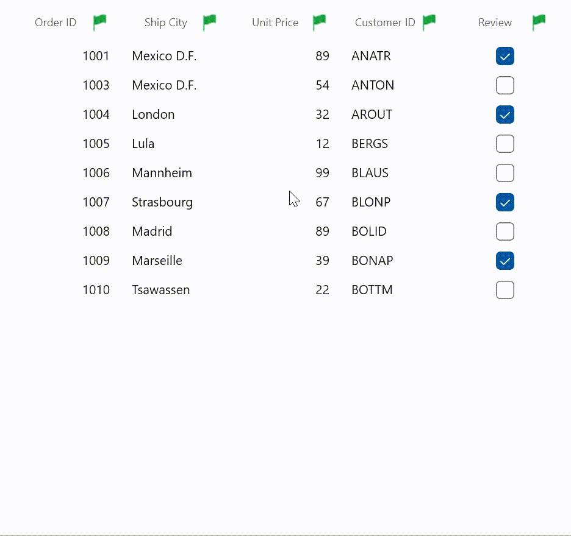

# How to change the default filter icon as an image in WinUI DataGrid (SfDataGrid)?

[WinUI DataGrid](https://www.syncfusion.com/winui-controls/datagrid) (SfDataGrid) does not provide the direct support to change the default filter icon as an image. You can change the default filter icon as an image by override the [FilterToggleButton](https://help.syncfusion.com/cr/winui/Syncfusion.UI.Xaml.Grids.FilterToggleButton.html) and defining the image instead of the path and loading the **BitmapImage** based on the filtered states.

```XML

<Style  TargetType="grid:FilterToggleButton">
     <Setter Property="Background" Value="Transparent"/>
     <Setter Property="Foreground" Value="Gray" />
     <Setter Property="Template">
         <Setter.Value>
             <ControlTemplate TargetType="grid:FilterToggleButton">
                 <Grid>
                     <VisualStateManager.VisualStateGroups>
                         <VisualStateGroup x:Name="CommonStates">
                             <VisualState x:Name="Normal"/>
                             <VisualState x:Name="PointerOver" />
                             <VisualState x:Name="Pressed"/>
                         </VisualStateGroup>
                         <VisualStateGroup x:Name="FilterStates">
                             <VisualState x:Name="Filtered">
                                 <Storyboard BeginTime="0">
                                     <ObjectAnimationUsingKeyFrames BeginTime="0"
                                                            Duration="1"
                                                            Storyboard.TargetName="PART_FilterToggleButtonIndicator"
                                                            Storyboard.TargetProperty="Source">
                                         <DiscreteObjectKeyFrame KeyTime="0" >
                                             <DiscreteObjectKeyFrame.Value>
                                                 <!--Load the image for filtered state in FilterToggleButtonIndicator-->
                                                 <BitmapImage  UriSource="Images/Filtered.png" />
                                             </DiscreteObjectKeyFrame.Value>
                                         </DiscreteObjectKeyFrame>
                                     </ObjectAnimationUsingKeyFrames>
                                 </Storyboard>
                             </VisualState>
                             <VisualState x:Name="UnFiltered">
                                 <Storyboard BeginTime="0">
                                     <ObjectAnimationUsingKeyFrames BeginTime="0"
                                                            Duration="1"
                                                            Storyboard.TargetName="PART_FilterToggleButtonIndicator"
                                                            Storyboard.TargetProperty="Source">
                                         <DiscreteObjectKeyFrame KeyTime="0" >
                                             <DiscreteObjectKeyFrame.Value>
                                                 <!--Load the image for unfiltered state in FilterToggleButtonIndicator-->
                                                 <BitmapImage  UriSource="Images/UnFiltered.png" />
                                             </DiscreteObjectKeyFrame.Value>
                                         </DiscreteObjectKeyFrame>
                                     </ObjectAnimationUsingKeyFrames>
                                 </Storyboard>
                             </VisualState>
                         </VisualStateGroup>
                     </VisualStateManager.VisualStateGroups>
                     <Border x:Name="PART_FilterToggleButtonBorder"
                     CornerRadius="2"
                     Width="{TemplateBinding Width}"
                     Height="{TemplateBinding Height}"
                     Background="{TemplateBinding Background}">
                         <!--Load the image in FilterToggleButtonIndicator-->
                         <Image Name="PART_FilterToggleButtonIndicator" Height="8" Width="8" 
                                Source="Images/UnFiltered.png"   />
                     </Border>
                 </Grid>
             </ControlTemplate>
         </Setter.Value>
     </Setter>
 </Style>

```



Take a moment to peruse the [WinUI DataGrid - Filtering](https://help.syncfusion.com/winui/datagrid/filtering) documentation, to learn more about filtering with code examples.
